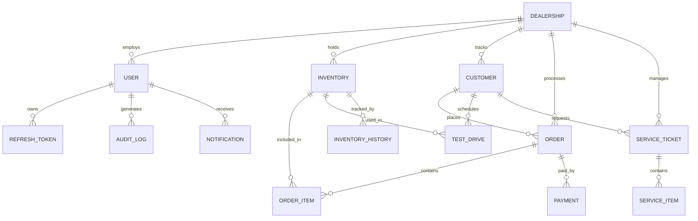

# Design Document — Dealer Management System (DMS)

## Overview

The DMS is a stateless, multi-tenant REST API backend built with Spring Boot 4 / Java 23. It serves a React TypeScript frontend and manages the full lifecycle of a multi-dealership automotive business: authentication, inventory, customers, sales orders, payments, test drives, service operations, notifications, and audit logging.

Key design goals:
- Stateless JWT authentication (no server-side session)
- Role-Based Access Control (RBAC) with dealership-scoped tenancy
- Async audit logging and notifications (non-blocking request path)
- Caffeine in-process caching with Spring Cache abstraction
- Uniform paginated API responses across all list endpoints
- Structured JSON logging with per-request correlation IDs

---

## Architecture

The system follows a strict layered architecture:

```
HTTP Client
    │
    ▼
[Filter Chain]
  CorrelationIdFilter → JwtAuthenticationFilter → RequestLoggingFilter
    │
    ▼
[Controller Layer]  — @RestController, input validation, HTTP mapping
    │
    ▼
[Service Layer]     — business logic, RBAC checks, cache, async dispatch
    │
    ▼
[Repository Layer]  — Spring Data JPA, custom JPQL/Specification queries
    │
    ▼
[MySQL via HikariCP]
```

Cross-cutting concerns (audit logging, notifications) are dispatched via `@Async` from the service layer and do not block the request thread.

### Mermaid Architecture Diagram

```mermaid
graph TD
    Client -->|HTTPS| FilterChain
    FilterChain --> CorrelationIdFilter
    CorrelationIdFilter --> JwtAuthFilter
    JwtAuthFilter --> RequestLoggingFilter
    RequestLoggingFilter --> DispatcherServlet
    DispatcherServlet --> Controllers
    Controllers --> Services
    Services --> Repositories
    Services -->|@Async| AuditService
    Services -->|@Async| NotificationService
    Repositories --> MySQL
    Services --> CaffeineCache
```

---

## Package Structure

```
com.hyundai.DMS
├── config/
│   ├── SecurityConfig.java
│   ├── AsyncConfig.java
│   ├── CacheConfig.java
│   ├── CorsConfig.java
│   └── JacksonConfig.java
├── filter/
│   ├── CorrelationIdFilter.java
│   ├── JwtAuthenticationFilter.java
│   └── RequestLoggingFilter.java
├── security/
│   ├── JwtService.java
│   ├── DmsUserDetails.java
│   └── DmsUserDetailsService.java
├── domain/
│   ├── entity/
│   │   ├── Dealership.java
│   │   ├── User.java
│   │   ├── RefreshToken.java
│   │   ├── Inventory.java
│   │   ├── InventoryHistory.java
│   │   ├── Customer.java
│   │   ├── TestDrive.java
│   │   ├── Order.java
│   │   ├── OrderItem.java
│   │   ├── Payment.java
│   │   ├── ServiceTicket.java
│   │   ├── ServiceItem.java
│   │   ├── AuditLog.java
│   │   └── Notification.java
│   └── enums/
│       ├── Role.java
│       ├── UserStatus.java
│       ├── InventoryStatus.java
│       ├── InventoryCondition.java
│       ├── FuelType.java
│       ├── Transmission.java
│       ├── BodyType.java
│       ├── CustomerStatus.java
│       ├── TestDriveStatus.java
│       ├── OrderStatus.java
│       ├── OrderItemType.java
│       ├── PaymentStatus.java
│       ├── PaymentMethod.java
│       ├── ServiceTicketStatus.java
│       ├── ServicePriority.java
│       ├── ServiceType.java
│       └── ServiceItemType.java
├── repository/
│   ├── DealershipRepository.java
│   ├── UserRepository.java
│   ├── RefreshTokenRepository.java
│   ├── InventoryRepository.java
│   ├── InventoryHistoryRepository.java
│   ├── CustomerRepository.java
│   ├── TestDriveRepository.java
│   ├── OrderRepository.java
│   ├── OrderItemRepository.java
│   ├── PaymentRepository.java
│   ├── ServiceTicketRepository.java
│   ├── ServiceItemRepository.java
│   ├── AuditLogRepository.java
│   └── NotificationRepository.java
├── service/
│   ├── AuthService.java
│   ├── TokenService.java
│   ├── DealershipService.java
│   ├── UserService.java
│   ├── InventoryService.java
│   ├── CustomerService.java
│   ├── TestDriveService.java
│   ├── OrderService.java
│   ├── OrderItemService.java
│   ├── PaymentService.java
│   ├── ServiceTicketService.java
│   ├── ServiceItemService.java
│   ├── AuditService.java
│   └── NotificationService.java
├── controller/
│   ├── AuthController.java
│   ├── DealershipController.java
│   ├── UserController.java
│   ├── InventoryController.java
│   ├── CustomerController.java
│   ├── TestDriveController.java
│   ├── OrderController.java
│   ├── OrderItemController.java
│   ├── PaymentController.java
│   ├── ServiceTicketController.java
│   ├── ServiceItemController.java
│   ├── AuditLogController.java
│   └── NotificationController.java
├── dto/
│   ├── request/   (one per create/update operation)
│   └── response/  (one per entity + PagedResponse<T>)
├── exception/
│   ├── GlobalExceptionHandler.java
│   ├── ResourceNotFoundException.java
│   ├── ConflictException.java
│   ├── ForbiddenException.java
│   ├── AccountLockedException.java
│   └── ValidationException.java
└── util/
    ├── SequenceGenerator.java
    ├── HtmlSanitizer.java
    └── PaginationUtils.java
```

---

## Components and Interfaces

### Filter Chain (ordered)

| Order | Filter | Responsibility |
|-------|--------|----------------|
| 1 | `CorrelationIdFilter` | Generate/propagate `X-Correlation-Id` UUID; put in MDC |
| 2 | `JwtAuthenticationFilter` | Extract Bearer token, validate, set `SecurityContext` |
| 3 | `RequestLoggingFilter` | Log method, URI, status, duration at INFO after response |

### Security Components

**`JwtService`**
- `generateAccessToken(UserDetails)` → signed JWT, 15-min expiry, claims: `user_id`, `role`, `dealership_id`
- `generateRefreshToken()` → random UUID raw token; caller stores SHA-256 hash
- `validateToken(String token)` → throws `JwtException` on invalid/expired
- `extractClaims(String token)` → returns `Claims`

**`DmsUserDetailsService`**
- Loads `User` by email; wraps in `DmsUserDetails` carrying `userId`, `role`, `dealershipId`

### Service Layer Contracts

Each service method receives the authenticated `DmsUserDetails` principal and enforces dealership-scoped tenancy before delegating to the repository. Cross-dealership access throws `ForbiddenException` (HTTP 403).

**`AuditService`** — `@Async("auditExecutor")`
- `log(Long userId, Long dealershipId, String action, String tableName, Long recordId, String oldValues, String newValues, String ipAddress, String userAgent)`

**`NotificationService`** — `@Async("notificationExecutor")`
- `send(Long recipientUserId, String title, String message, String referenceType, Long referenceId)`

### Repository Layer

All repositories extend `JpaRepository` and `JpaSpecificationExecutor` to support dynamic filter predicates via Spring Data `Specification<T>`.

Custom query methods use JPQL (not native SQL) to remain database-portable and avoid SQL injection.

---

## Data Models

### Entity Relationship Overview



### Table Definitions

#### `dealerships`
| Column | Type | Constraints |
|--------|------|-------------|
| id | BIGINT | PK, AUTO_INCREMENT |
| name | VARCHAR(150) | NOT NULL |
| email | VARCHAR(150) | UNIQUE, NOT NULL |
| phone | VARCHAR(20) | NOT NULL |
| address | TEXT | |
| city | VARCHAR(100) | |
| state | VARCHAR(100) | |
| license_no | VARCHAR(100) | UNIQUE, NOT NULL |
| is_active | TINYINT(1) | DEFAULT 1 |
| created_at | DATETIME | NOT NULL |
| updated_at | DATETIME | NOT NULL |

Indexes: `idx_dealerships_city_state`, `idx_dealerships_is_active`

#### `users`
| Column | Type | Constraints |
|--------|------|-------------|
| id | BIGINT | PK, AUTO_INCREMENT |
| dealership_id | BIGINT | FK → dealerships.id |
| first_name | VARCHAR(100) | NOT NULL |
| last_name | VARCHAR(100) | NOT NULL |
| email | VARCHAR(150) | UNIQUE, NOT NULL |
| password_hash | VARCHAR(255) | NOT NULL |
| role | ENUM(super_admin, admin, manager, salesperson, technician, receptionist) | NOT NULL |
| status | ENUM(active, inactive, suspended) | DEFAULT active |
| failed_login_attempts | INT | DEFAULT 0 |
| locked_until | DATETIME | NULLABLE |
| last_login | DATETIME | NULLABLE |
| password_changed_at | DATETIME | NULLABLE |
| created_at | DATETIME | NOT NULL |
| updated_at | DATETIME | NOT NULL |

Indexes: `idx_users_email`, `idx_users_dealership_role`, `idx_users_status`

#### `refresh_tokens`
| Column | Type | Constraints |
|--------|------|-------------|
| id | BIGINT | PK, AUTO_INCREMENT |
| user_id | BIGINT | FK → users.id |
| token_hash | VARCHAR(64) | UNIQUE, NOT NULL (SHA-256 hex) |
| expires_at | DATETIME | NOT NULL |
| is_revoked | TINYINT(1) | DEFAULT 0 |
| revoked_at | DATETIME | NULLABLE |
| created_at | DATETIME | NOT NULL |

Indexes: `idx_refresh_tokens_user_id`, `idx_refresh_tokens_token_hash`

#### `inventory`
| Column | Type | Constraints |
|--------|------|-------------|
| id | BIGINT | PK, AUTO_INCREMENT |
| dealership_id | BIGINT | FK → dealerships.id |
| vin | VARCHAR(17) | UNIQUE, NOT NULL |
| make | VARCHAR(100) | NOT NULL |
| model | VARCHAR(100) | NOT NULL |
| variant | VARCHAR(100) | |
| year | SMALLINT | NOT NULL |
| fuel_type | ENUM(petrol, diesel, electric, hybrid, cng) | NOT NULL |
| transmission | ENUM(manual, automatic, cvt, amt) | NOT NULL |
| body_type | ENUM(sedan, suv, hatchback, coupe, convertible, van, truck, wagon) | |
| color | VARCHAR(50) | |
| mileage | INT | DEFAULT 0 |
| condition_type | ENUM(new, used, certified_pre_owned) | NOT NULL |
| status | ENUM(available, reserved, test_drive, sold, inactive) | DEFAULT available |
| cost_price | DECIMAL(12,2) | NOT NULL |
| selling_price | DECIMAL(12,2) | NOT NULL |
| intake_date | DATE | NOT NULL |
| notes | TEXT | |
| created_at | DATETIME | NOT NULL |
| updated_at | DATETIME | NOT NULL |

Indexes: `idx_inventory_dealership_status`, `idx_inventory_make_model`, `idx_inventory_vin`, `idx_inventory_selling_price`, `idx_inventory_year`

#### `inventory_history`
| Column | Type | Constraints |
|--------|------|-------------|
| id | BIGINT | PK, AUTO_INCREMENT |
| inventory_id | BIGINT | FK → inventory.id |
| field_name | VARCHAR(100) | NOT NULL |
| old_value | TEXT | |
| new_value | TEXT | |
| changed_by | BIGINT | FK → users.id |
| reason | TEXT | |
| created_at | DATETIME | NOT NULL |

Indexes: `idx_inv_history_inventory_id`, `idx_inv_history_created_at`

#### `customers`
| Column | Type | Constraints |
|--------|------|-------------|
| id | BIGINT | PK, AUTO_INCREMENT |
| dealership_id | BIGINT | FK → dealerships.id |
| first_name | VARCHAR(100) | NOT NULL |
| last_name | VARCHAR(100) | NOT NULL |
| email | VARCHAR(150) | NULLABLE |
| phone | VARCHAR(20) | NOT NULL |
| status | ENUM(lead, prospect, customer, lost) | DEFAULT lead |
| source | VARCHAR(100) | |
| assigned_to | BIGINT | FK → users.id, NULLABLE |
| notes | TEXT | |
| created_at | DATETIME | NOT NULL |
| updated_at | DATETIME | NOT NULL |

Indexes: `idx_customers_dealership_status`, `idx_customers_assigned_to`, `idx_customers_phone`, `idx_customers_email`

#### `test_drives`
| Column | Type | Constraints |
|--------|------|-------------|
| id | BIGINT | PK, AUTO_INCREMENT |
| dealership_id | BIGINT | FK → dealerships.id |
| customer_id | BIGINT | FK → customers.id |
| inventory_id | BIGINT | FK → inventory.id |
| staff_id | BIGINT | FK → users.id |
| scheduled_at | DATETIME | NOT NULL |
| started_at | DATETIME | NULLABLE |
| ended_at | DATETIME | NULLABLE |
| status | ENUM(scheduled, in_progress, completed, cancelled) | DEFAULT scheduled |
| odometer_before | INT | NULLABLE |
| odometer_after | INT | NULLABLE |
| notes | TEXT | |
| created_at | DATETIME | NOT NULL |
| updated_at | DATETIME | NOT NULL |

Indexes: `idx_test_drives_inventory_id`, `idx_test_drives_customer_id`, `idx_test_drives_staff_id`, `idx_test_drives_scheduled_at`

#### `orders`
| Column | Type | Constraints |
|--------|------|-------------|
| id | BIGINT | PK, AUTO_INCREMENT |
| dealership_id | BIGINT | FK → dealerships.id |
| order_number | VARCHAR(30) | UNIQUE, NOT NULL |
| customer_id | BIGINT | FK → customers.id |
| salesperson_id | BIGINT | FK → users.id |
| status | ENUM(draft, confirmed, processing, delivered, cancelled) | DEFAULT draft |
| order_date | DATE | NOT NULL |
| subtotal | DECIMAL(14,2) | DEFAULT 0 |
| discount_amount | DECIMAL(14,2) | DEFAULT 0 |
| tax_rate | DECIMAL(5,2) | DEFAULT 0 |
| tax_amount | DECIMAL(14,2) | DEFAULT 0 |
| trade_in_value | DECIMAL(14,2) | DEFAULT 0 |
| total_amount | DECIMAL(14,2) | DEFAULT 0 |
| cancellation_reason | TEXT | NULLABLE |
| notes | TEXT | |
| created_at | DATETIME | NOT NULL |
| updated_at | DATETIME | NOT NULL |

Indexes: `idx_orders_dealership_status`, `idx_orders_customer_id`, `idx_orders_salesperson_id`, `idx_orders_order_date`, `idx_orders_order_number`

#### `order_items`
| Column | Type | Constraints |
|--------|------|-------------|
| id | BIGINT | PK, AUTO_INCREMENT |
| order_id | BIGINT | FK → orders.id |
| item_type | ENUM(vehicle, accessory, insurance, warranty, fee, other) | NOT NULL |
| inventory_id | BIGINT | FK → inventory.id, NULLABLE |
| description | VARCHAR(255) | NOT NULL |
| unit_price | DECIMAL(12,2) | NOT NULL |
| quantity | INT | DEFAULT 1 |
| discount | DECIMAL(12,2) | DEFAULT 0 |
| line_total | DECIMAL(12,2) | NOT NULL |
| created_at | DATETIME | NOT NULL |
| updated_at | DATETIME | NOT NULL |

Indexes: `idx_order_items_order_id`, `idx_order_items_inventory_id`

#### `payments`
| Column | Type | Constraints |
|--------|------|-------------|
| id | BIGINT | PK, AUTO_INCREMENT |
| order_id | BIGINT | FK → orders.id |
| amount | DECIMAL(12,2) | NOT NULL |
| method | ENUM(cash, card, bank_transfer, finance, cheque) | NOT NULL |
| status | ENUM(pending, completed, failed, refunded) | DEFAULT pending |
| reference_no | VARCHAR(100) | NULLABLE |
| notes | TEXT | |
| paid_at | DATETIME | NULLABLE |
| created_at | DATETIME | NOT NULL |
| updated_at | DATETIME | NOT NULL |

Indexes: `idx_payments_order_id`, `idx_payments_status`

#### `service_tickets`
| Column | Type | Constraints |
|--------|------|-------------|
| id | BIGINT | PK, AUTO_INCREMENT |
| dealership_id | BIGINT | FK → dealerships.id |
| ticket_number | VARCHAR(30) | UNIQUE, NOT NULL |
| customer_id | BIGINT | FK → customers.id |
| assigned_to | BIGINT | FK → users.id, NULLABLE |
| vehicle_make | VARCHAR(100) | |
| vehicle_model | VARCHAR(100) | |
| vehicle_year | SMALLINT | |
| vehicle_vin | VARCHAR(17) | |
| license_plate | VARCHAR(20) | |
| odometer_in | INT | NULLABLE |
| odometer_out | INT | NULLABLE |
| status | ENUM(open, in_progress, completed, delivered, cancelled) | DEFAULT open |
| priority | ENUM(low, medium, high, urgent) | DEFAULT medium |
| service_type | ENUM(maintenance, repair, inspection, recall, warranty, other) | NOT NULL |
| diagnosis | TEXT | NULLABLE |
| customer_approval | TINYINT(1) | DEFAULT 0 |
| drop_off_at | DATETIME | NULLABLE |
| promised_at | DATETIME | NULLABLE |
| completed_at | DATETIME | NULLABLE |
| delivered_at | DATETIME | NULLABLE |
| total_parts | DECIMAL(12,2) | DEFAULT 0 |
| total_labor | DECIMAL(12,2) | DEFAULT 0 |
| total_cost | DECIMAL(12,2) | DEFAULT 0 |
| notes | TEXT | |
| created_at | DATETIME | NOT NULL |
| updated_at | DATETIME | NOT NULL |

Indexes: `idx_svc_tickets_dealership_status`, `idx_svc_tickets_customer_id`, `idx_svc_tickets_assigned_to`, `idx_svc_tickets_priority`, `idx_svc_tickets_ticket_number`

#### `service_items`
| Column | Type | Constraints |
|--------|------|-------------|
| id | BIGINT | PK, AUTO_INCREMENT |
| ticket_id | BIGINT | FK → service_tickets.id |
| item_type | ENUM(part, labor, consumable, external) | NOT NULL |
| description | VARCHAR(255) | NOT NULL |
| part_number | VARCHAR(100) | NULLABLE |
| unit_cost | DECIMAL(10,2) | NOT NULL |
| quantity | DECIMAL(10,3) | DEFAULT 1 |
| line_total | DECIMAL(12,2) | NOT NULL |
| created_at | DATETIME | NOT NULL |
| updated_at | DATETIME | NOT NULL |

Indexes: `idx_service_items_ticket_id`

#### `audit_logs`
| Column | Type | Constraints |
|--------|------|-------------|
| id | BIGINT | PK, AUTO_INCREMENT |
| user_id | BIGINT | FK → users.id, NULLABLE |
| dealership_id | BIGINT | NULLABLE |
| action | VARCHAR(50) | NOT NULL |
| table_name | VARCHAR(100) | NULLABLE |
| record_id | BIGINT | NULLABLE |
| old_values | JSON | NULLABLE |
| new_values | JSON | NULLABLE |
| ip_address | VARCHAR(45) | NULLABLE |
| user_agent | VARCHAR(500) | NULLABLE |
| created_at | DATETIME | NOT NULL |

Indexes: `idx_audit_logs_user_id`, `idx_audit_logs_dealership_id`, `idx_audit_logs_action`, `idx_audit_logs_table_record`, `idx_audit_logs_created_at`

#### `notifications`
| Column | Type | Constraints |
|--------|------|-------------|
| id | BIGINT | PK, AUTO_INCREMENT |
| user_id | BIGINT | FK → users.id |
| title | VARCHAR(255) | NOT NULL |
| message | TEXT | NOT NULL |
| is_read | TINYINT(1) | DEFAULT 0 |
| read_at | DATETIME | NULLABLE |
| reference_type | VARCHAR(50) | NULLABLE |
| reference_id | BIGINT | NULLABLE |
| created_at | DATETIME | NOT NULL |

Indexes: `idx_notifications_user_id_is_read`, `idx_notifications_created_at`

---

## REST API Endpoint Design

All endpoints are prefixed with `/api/v1`. Authentication is required on all endpoints except `POST /api/v1/auth/login` and `POST /api/v1/auth/refresh`.

### Authentication

| Method | Path | Roles | Description |
|--------|------|-------|-------------|
| POST | `/auth/login` | Public | Email/password login; returns access + refresh tokens |
| POST | `/auth/refresh` | Public | Exchange refresh token for new token pair |
| POST | `/auth/logout` | Authenticated | Revoke all refresh tokens for current user |
| PUT | `/auth/password` | Authenticated | Change own password |

**POST /auth/login — Request**
```json
{ "email": "user@example.com", "password": "Secret@123" }
```
**POST /auth/login — Response 200**
```json
{
  "accessToken": "eyJ...",
  "refreshToken": "uuid-raw-token",
  "expiresIn": 900,
  "tokenType": "Bearer"
}
```

### Dealerships

| Method | Path | Roles | Description |
|--------|------|-------|-------------|
| GET | `/dealerships` | super_admin, admin | List/search dealerships (paginated) |
| POST | `/dealerships` | super_admin, admin | Create dealership |
| GET | `/dealerships/{id}` | super_admin, admin | Get dealership by ID |
| PUT | `/dealerships/{id}` | super_admin, admin | Update dealership |
| DELETE | `/dealerships/{id}` | super_admin, admin | Soft-delete (set is_active=0) |

Query params for GET list: `name`, `city`, `state`, `isActive`, `page`, `size`, `sort`

### Users

| Method | Path | Roles | Description |
|--------|------|-------|-------------|
| GET | `/users` | super_admin, admin, manager | List/filter users (paginated) |
| POST | `/users` | super_admin, admin, manager | Create user |
| GET | `/users/{id}` | super_admin, admin, manager | Get user by ID |
| PUT | `/users/{id}` | super_admin, admin, manager | Update user |
| PATCH | `/users/{id}/status` | super_admin, admin, manager | Change user status |

Query params: `dealershipId`, `role`, `status`, `search` (name/email), `page`, `size`, `sort`

### Inventory

| Method | Path | Roles | Description |
|--------|------|-------|-------------|
| GET | `/inventory` | All authenticated | List/filter inventory (paginated, cached) |
| POST | `/inventory` | salesperson and above | Create inventory record |
| GET | `/inventory/{id}` | All authenticated | Get inventory by ID |
| PUT | `/inventory/{id}` | salesperson and above | Update inventory record |
| DELETE | `/inventory/{id}` | admin, manager | Delete inventory record |
| GET | `/inventory/{id}/history` | manager, admin, super_admin | Get inventory change history |

Query params: `dealershipId`, `make`, `model`, `year`, `fuelType`, `transmission`, `bodyType`, `conditionType`, `status`, `minPrice`, `maxPrice`, `search`, `page`, `size`, `sort`

### Customers

| Method | Path | Roles | Description |
|--------|------|-------|-------------|
| GET | `/customers` | salesperson and above | List/filter customers (paginated) |
| POST | `/customers` | salesperson and above | Create customer |
| GET | `/customers/{id}` | salesperson and above | Get customer by ID |
| PUT | `/customers/{id}` | salesperson and above | Update customer |
| DELETE | `/customers/{id}` | manager, admin, super_admin | Delete customer |

Query params: `dealershipId`, `status`, `source`, `assignedTo`, `search`, `page`, `size`, `sort`

### Test Drives

| Method | Path | Roles | Description |
|--------|------|-------|-------------|
| GET | `/test-drives` | All authenticated | List/filter test drives (paginated) |
| POST | `/test-drives` | receptionist, salesperson and above | Schedule test drive |
| GET | `/test-drives/{id}` | All authenticated | Get test drive by ID |
| PUT | `/test-drives/{id}` | receptionist, salesperson and above | Update test drive |
| PATCH | `/test-drives/{id}/cancel` | receptionist, salesperson and above | Cancel test drive |

Query params: `status`, `customerId`, `inventoryId`, `staffId`, `scheduledFrom`, `scheduledTo`, `page`, `size`, `sort`

### Orders

| Method | Path | Roles | Description |
|--------|------|-------|-------------|
| GET | `/orders` | salesperson and above | List/filter orders (paginated) |
| POST | `/orders` | salesperson and above | Create order |
| GET | `/orders/{id}` | salesperson and above | Get order by ID |
| PUT | `/orders/{id}` | salesperson and above | Update order |
| PATCH | `/orders/{id}/status` | salesperson and above | Transition order status |

Query params: `status`, `customerId`, `salespersonId`, `dealershipId`, `orderDateFrom`, `orderDateTo`, `page`, `size`, `sort`

### Order Items

| Method | Path | Roles | Description |
|--------|------|-------|-------------|
| GET | `/orders/{orderId}/items` | salesperson and above | List order items |
| POST | `/orders/{orderId}/items` | salesperson and above | Add order item |
| PUT | `/orders/{orderId}/items/{itemId}` | salesperson and above | Update order item |
| DELETE | `/orders/{orderId}/items/{itemId}` | salesperson and above | Remove order item |

### Payments

| Method | Path | Roles | Description |
|--------|------|-------|-------------|
| GET | `/payments` | manager and above | List/filter payments (paginated) |
| POST | `/payments` | manager and above | Record payment |
| GET | `/payments/{id}` | manager and above | Get payment by ID |
| PUT | `/payments/{id}` | manager and above | Update payment |

Query params: `orderId`, `status`, `method`, `page`, `size`, `sort`

### Service Tickets

| Method | Path | Roles | Description |
|--------|------|-------|-------------|
| GET | `/service-tickets` | All authenticated | List/filter service tickets (paginated) |
| POST | `/service-tickets` | receptionist and above | Create service ticket |
| GET | `/service-tickets/{id}` | All authenticated | Get service ticket by ID |
| PUT | `/service-tickets/{id}` | technician and above | Update service ticket |
| PATCH | `/service-tickets/{id}/status` | technician and above | Transition ticket status |

Query params: `status`, `priority`, `serviceType`, `assignedTo`, `customerId`, `dealershipId`, `page`, `size`, `sort`

### Service Items

| Method | Path | Roles | Description |
|--------|------|-------|-------------|
| GET | `/service-tickets/{ticketId}/items` | All authenticated | List service items |
| POST | `/service-tickets/{ticketId}/items` | technician and above | Add service item |
| PUT | `/service-tickets/{ticketId}/items/{itemId}` | technician and above | Update service item |
| DELETE | `/service-tickets/{ticketId}/items/{itemId}` | technician and above | Remove service item |

### Audit Logs

| Method | Path | Roles | Description |
|--------|------|-------|-------------|
| GET | `/audit-logs` | admin, super_admin | Query audit logs (paginated) |

Query params: `userId`, `dealershipId`, `action`, `tableName`, `recordId`, `createdFrom`, `createdTo`, `page`, `size`, `sort`

### Notifications

| Method | Path | Roles | Description |
|--------|------|-------|-------------|
| GET | `/notifications` | Authenticated (own) | List own notifications (paginated) |
| PATCH | `/notifications/{id}/read` | Authenticated (own) | Mark notification as read |
| DELETE | `/notifications/{id}` | Authenticated (own) | Delete own notification |

Query params: `isRead`, `page`, `size`, `sort`

### Uniform Paginated Response Envelope

All list endpoints return:
```json
{
  "content": [...],
  "page": 0,
  "size": 20,
  "totalElements": 150,
  "totalPages": 8,
  "last": false
}
```

---

## Security Design

### JWT Filter Chain

```
Request
  │
  ├─ Extract "Authorization: Bearer <token>" header
  ├─ Validate signature, expiry (exp claim)
  ├─ Extract user_id, role, dealership_id claims
  ├─ Load UserDetails from DB (or cache)
  ├─ Set UsernamePasswordAuthenticationToken in SecurityContextHolder
  └─ Continue filter chain
```

If token is missing or invalid → `JwtAuthenticationEntryPoint` returns HTTP 401 JSON.

### RBAC Implementation

Role hierarchy is enforced at two levels:

1. **Method-level** via `@PreAuthorize` annotations on service methods:
   ```java
   @PreAuthorize("hasAnyRole('SUPER_ADMIN','ADMIN')")
   public DealershipResponse createDealership(...)
   ```

2. **Data-level** (dealership tenancy) inside service methods:
   ```java
   if (!principal.isSuperAdmin() && !principal.getDealershipId().equals(resource.getDealershipId())) {
       throw new ForbiddenException("Access denied to this dealership's data");
   }
   ```

### Role Permission Matrix

| Resource | super_admin | admin | manager | salesperson | technician | receptionist |
|----------|-------------|-------|---------|-------------|------------|--------------|
| Dealerships (write) | ✓ | ✓ | — | — | — | — |
| Users (write) | ✓ | ✓ | ✓ (own dealership) | — | — | — |
| Inventory (write) | ✓ | ✓ | ✓ | ✓ | — | — |
| Customers (write) | ✓ | ✓ | ✓ | ✓ | — | — |
| Test Drives (write) | ✓ | ✓ | ✓ | ✓ | — | ✓ |
| Orders (write) | ✓ | ✓ | ✓ | ✓ | — | — |
| Payments (write) | ✓ | ✓ | ✓ | — | — | — |
| Service Tickets (write) | ✓ | ✓ | ✓ | — | ✓ | ✓ |
| Service Items (write) | ✓ | ✓ | ✓ | — | ✓ | — |
| Audit Logs (read) | ✓ | ✓ | — | — | — | — |
| Inventory History (read) | ✓ | ✓ | ✓ | — | — | — |

### Security Headers

Configured in `SecurityConfig` via `HttpSecurity.headers()`:
- `X-Content-Type-Options: nosniff`
- `X-Frame-Options: DENY`
- `Strict-Transport-Security: max-age=31536000`

CSRF disabled (stateless JWT). CORS configured with explicit whitelist via `CorsConfig`.

### Input Sanitization

`HtmlSanitizer.sanitize(String input)` strips HTML tags using a simple regex/allowlist before any string field is persisted. Applied in service layer before calling repository save.

---

## Caching Strategy

### Configuration (`CacheConfig.java`)

```java
@Bean
public CacheManager cacheManager() {
    CaffeineCacheManager manager = new CaffeineCacheManager();
    manager.setCaffeine(Caffeine.newBuilder()
        .expireAfterWrite(5, TimeUnit.MINUTES)
        .maximumSize(1000)
        .recordStats());
    return manager;
}
```

Per-cache TTL overrides via named caches:

| Cache Name | TTL | Eviction Trigger |
|------------|-----|-----------------|
| `inventoryList` | 5 min | Any inventory write |
| `dealershipById` | 10 min | Dealership update |

### Usage Pattern

```java
@Cacheable(value = "inventoryList", key = "#filter.cacheKey()")
public PagedResponse<InventoryResponse> listInventory(InventoryFilter filter, Pageable pageable) { ... }

@CacheEvict(value = "inventoryList", allEntries = true)
public InventoryResponse createInventory(InventoryRequest req) { ... }
```

Cache hit/miss events logged at DEBUG level via `CacheLogger` implementing `CacheEventListener`.

HTTP `Cache-Control: max-age=300, public` header added to inventory list responses via a `ResponseBodyAdvice` or directly in the controller.

---

## Async Design

### Thread Pool Configuration (`AsyncConfig.java`)

```java
@Bean("auditExecutor")
public Executor auditExecutor() {
    ThreadPoolTaskExecutor exec = new ThreadPoolTaskExecutor();
    exec.setCorePoolSize(2);
    exec.setMaxPoolSize(5);
    exec.setQueueCapacity(500);
    exec.setThreadNamePrefix("audit-");
    exec.initialize();
    return exec;
}

@Bean("notificationExecutor")
public Executor notificationExecutor() {
    ThreadPoolTaskExecutor exec = new ThreadPoolTaskExecutor();
    exec.setCorePoolSize(2);
    exec.setMaxPoolSize(5);
    exec.setQueueCapacity(500);
    exec.setThreadNamePrefix("notif-");
    exec.initialize();
    return exec;
}
```

`@EnableAsync` on `AsyncConfig`. Both `AuditService` and `NotificationService` methods annotated with `@Async("auditExecutor")` / `@Async("notificationExecutor")` respectively.

MDC correlation ID is propagated to async threads via a `TaskDecorator` that copies the MDC context before thread handoff.

---

## Error Handling Design

### `GlobalExceptionHandler` (`@RestControllerAdvice`)

All exceptions are caught and mapped to a uniform error envelope:

```json
{
  "status": 400,
  "error": "Bad Request",
  "message": "Validation failed",
  "timestamp": "2025-03-22T10:15:30Z",
  "correlationId": "uuid",
  "fieldErrors": [
    { "field": "email", "message": "must be a well-formed email address" }
  ]
}
```

| Exception | HTTP Status | Notes |
|-----------|-------------|-------|
| `MethodArgumentNotValidException` | 400 | Lists all field violations |
| `ConstraintViolationException` | 400 | Bean Validation on path/query params |
| `MethodArgumentTypeMismatchException` | 400 | Type mismatch on path/query params |
| `ResourceNotFoundException` | 404 | Entity not found |
| `ConflictException` | 409 | Duplicate key, business rule conflict |
| `ForbiddenException` | 403 | RBAC violation |
| `AccountLockedException` | 423 | User locked out |
| `DataIntegrityViolationException` | 409 | DB constraint; raw SQL never exposed |
| `AccessDeniedException` | 403 | Spring Security |
| `AuthenticationException` | 401 | Spring Security |
| `Exception` (catch-all) | 500 | Generic message; full stack trace logged at ERROR |

---

## Logging and Observability Design

### Correlation ID Flow

```
Incoming Request
  → CorrelationIdFilter reads X-Correlation-Id header (or generates UUID)
  → Stores in MDC: MDC.put("correlationId", id)
  → Adds to response header: X-Correlation-Id
  → All log statements in that thread include correlationId from MDC
  → TaskDecorator copies MDC to async threads
```

### Request Logging

`RequestLoggingFilter` wraps the response with `ContentCachingResponseWrapper` and logs after the response is committed:

```
INFO  [correlationId=abc123] GET /api/v1/inventory 200 45ms
```

### Logback Configuration

- **Default profile**: pattern-based console output
- **`prod` profile** (`logback-spring.xml`): JSON encoder via `logstash-logback-encoder`

```xml
<springProfile name="prod">
  <appender name="JSON_CONSOLE" class="ch.qos.logback.core.ConsoleAppender">
    <encoder class="net.logstash.logback.encoder.LogstashEncoder"/>
  </appender>
</springProfile>
```

Sensitive field masking: a custom `MaskingPatternLayout` replaces values of fields named `password`, `password_hash`, `token`, `tokenHash` with `[REDACTED]` in log output.

---

## Pagination, Sorting, and Filtering Design

### Pageable Resolution

Spring MVC `PageableHandlerMethodArgumentResolver` resolves `page`, `size`, `sort` query params into a `Pageable` object automatically. Max page size enforced via:

```java
resolver.setMaxPageSize(100);
resolver.setFallbackPageable(PageRequest.of(0, 20));
```

### Filter Pattern

Each list endpoint has a corresponding `XxxFilter` record/class with fields matching supported query params. A `XxxSpecification` implements `Specification<Xxx>` and builds JPA `Predicate` objects dynamically (AND-combined).

```java
public class InventorySpecification implements Specification<Inventory> {
    @Override
    public Predicate toPredicate(Root<Inventory> root, CriteriaQuery<?> query, CriteriaBuilder cb) {
        List<Predicate> predicates = new ArrayList<>();
        if (filter.getMake() != null) predicates.add(cb.equal(root.get("make"), filter.getMake()));
        // ... other filters
        return cb.and(predicates.toArray(new Predicate[0]));
    }
}
```

### Sort Validation

A `SortValidator` utility checks the requested sort field against an allowlist of indexed columns for each entity. Invalid sort fields throw `ValidationException` (HTTP 400).

---

## pom.xml Dependency Additions

Add the following dependencies to `pom.xml`:

```xml
<!-- JWT -->
<dependency>
    <groupId>io.jsonwebtoken</groupId>
    <artifactId>jjwt-api</artifactId>
    <version>0.12.6</version>
</dependency>
<dependency>
    <groupId>io.jsonwebtoken</groupId>
    <artifactId>jjwt-impl</artifactId>
    <version>0.12.6</version>
    <scope>runtime</scope>
</dependency>
<dependency>
    <groupId>io.jsonwebtoken</groupId>
    <artifactId>jjwt-jackson</artifactId>
    <version>0.12.6</version>
    <scope>runtime</scope>
</dependency>

<!-- Bean Validation -->
<dependency>
    <groupId>org.springframework.boot</groupId>
    <artifactId>spring-boot-starter-validation</artifactId>
</dependency>

<!-- Caffeine Cache -->
<dependency>
    <groupId>org.springframework.boot</groupId>
    <artifactId>spring-boot-starter-cache</artifactId>
</dependency>
<dependency>
    <groupId>com.github.ben-manes.caffeine</groupId>
    <artifactId>caffeine</artifactId>
</dependency>

<!-- JSON structured logging (prod profile) -->
<dependency>
    <groupId>net.logstash.logback</groupId>
    <artifactId>logstash-logback-encoder</artifactId>
    <version>8.0</version>
</dependency>
```

---

## Correctness Properties

*A property is a characteristic or behavior that should hold true across all valid executions of a system — essentially, a formal statement about what the system should do. Properties serve as the bridge between human-readable specifications and machine-verifiable correctness guarantees.*

---

### Property 1: JWT Structure Invariant

*For any* valid user credentials submitted to the login endpoint, the returned access token, when decoded, SHALL contain `user_id`, `role`, and `dealership_id` claims, and the difference between `exp` and `iat` SHALL equal 900 seconds (15 minutes).

**Validates: Requirements 1.1, 2.5**

---

### Property 2: Failed Login Increments Counter

*For any* user account and any sequence of N failed login attempts with incorrect credentials, the `failed_login_attempts` field SHALL equal N after those attempts.

**Validates: Requirements 1.4**

---

### Property 3: Successful Login Resets Counter

*For any* user account with any number of prior failed login attempts, a successful login SHALL reset `failed_login_attempts` to 0 and update `last_login` to a non-null timestamp.

**Validates: Requirements 1.6**

---

### Property 4: Locked Account Rejection

*For any* user whose `locked_until` timestamp is in the future, a login attempt SHALL return HTTP 423 regardless of whether the submitted password is correct.

**Validates: Requirements 1.3**

---

### Property 5: Inactive/Suspended Account Rejection

*For any* user whose `status` is `inactive` or `suspended`, a login attempt SHALL return HTTP 403.

**Validates: Requirements 1.8**

---

### Property 6: Audit Log Written on Every Login Attempt

*For any* login attempt (successful or failed), exactly one `audit_logs` record SHALL be created with action `LOGIN` or `LOGIN_FAILED`, containing the user's IP address and user-agent.

**Validates: Requirements 1.7**

---

### Property 7: Refresh Token Hash Storage

*For any* issued refresh token, the value stored in `refresh_tokens.token_hash` SHALL equal the SHA-256 hex digest of the raw token, and the raw token SHALL NOT appear anywhere in the database.

**Validates: Requirements 2.1**

---

### Property 8: Refresh Token Rotation

*For any* valid, non-revoked, non-expired refresh token, calling the refresh endpoint SHALL produce a new access token and a new refresh token, and SHALL mark the old refresh token as revoked (`is_revoked = 1`, `revoked_at` set).

**Validates: Requirements 2.2**

---

### Property 9: Revoked/Expired Token Rejection

*For any* refresh token that is either revoked or past its `expires_at` timestamp, calling the refresh endpoint SHALL return HTTP 401.

**Validates: Requirements 2.3**

---

### Property 10: Logout Revokes All Tokens

*For any* user, after a successful logout request, querying `refresh_tokens` for that user SHALL return zero records with `is_revoked = 0`.

**Validates: Requirements 2.4**

---

### Property 11: Cross-Dealership Access Denied

*For any* user with role `salesperson`, `technician`, `receptionist`, or `manager`, any request to read or write a resource belonging to a different dealership SHALL return HTTP 403.

**Validates: Requirements 3.2, 3.3**

---

### Property 12: Role-Gated Write Operations

*For any* user with role `salesperson`, `technician`, or `receptionist`, any attempt to create, update, or deactivate a dealership record SHALL return HTTP 403. *For any* user with role `salesperson`, `technician`, or `receptionist`, any attempt to create or modify a user account SHALL return HTTP 403.

**Validates: Requirements 3.4, 3.5**

---

### Property 13: Audit Log Access Restricted

*For any* user with role `salesperson`, `technician`, or `receptionist`, any request to the audit log endpoint SHALL return HTTP 403.

**Validates: Requirements 3.7**

---

### Property 14: Password Complexity Rejection

*For any* string that is shorter than 8 characters, or lacks at least one uppercase letter, one digit, and one special character, submitting it as a new password SHALL return HTTP 400 with a descriptive validation message.

**Validates: Requirements 4.5**

---

### Property 15: Password Change Revokes Tokens

*For any* user, after a successful password change, querying `refresh_tokens` for that user SHALL return zero records with `is_revoked = 0`.

**Validates: Requirements 4.3**

---

### Property 16: Duplicate Dealership Rejection

*For any* two dealership creation requests sharing the same `email` or `license_no`, the second request SHALL return HTTP 409 identifying the conflicting field.

**Validates: Requirements 5.2**

---

### Property 17: Dealership Field Validation

*For any* dealership create or update request containing a malformed email or a phone number not matching the 10–15 digit pattern, the request SHALL return HTTP 400.

**Validates: Requirements 5.3**

---

### Property 18: Filter Results Match Criteria

*For any* list request with one or more active filter parameters, every item in the `content` array of the response SHALL satisfy all applied filter conditions (AND semantics).

**Validates: Requirements 5.4, 6.4, 7.4, 8.3, 9.6, 10.7, 12.3, 13.6, 15.2, 16.2, 19.5**

---

### Property 19: Pagination Envelope Invariant

*For any* list endpoint response, the JSON envelope SHALL contain `content`, `page`, `size`, `totalElements`, `totalPages`, and `last` fields, with `size` never exceeding 100.

**Validates: Requirements 5.5, 6.5, 7.7, 8.6, 9.7, 10.9, 12.4, 13.8, 15.4, 16.3, 17.2, 19.1, 19.2, 19.3**

---

### Property 20: Password Hash Never Exposed

*For any* user API response (list or single), the JSON body SHALL NOT contain a field named `password_hash` or `failedLoginAttempts`.

**Validates: Requirements 6.6**

---

### Property 21: Suspension Revokes Tokens

*For any* user whose `status` is changed to `suspended`, querying `refresh_tokens` for that user immediately after SHALL return zero records with `is_revoked = 0`.

**Validates: Requirements 6.7**

---

### Property 22: Duplicate VIN Rejection

*For any* two inventory creation requests sharing the same `vin`, the second request SHALL return HTTP 409.

**Validates: Requirements 7.2**

---

### Property 23: Inventory Field Validation

*For any* inventory create or update request where `selling_price` ≤ 0 or `year` is outside [1900, currentYear+1], the request SHALL return HTTP 400.

**Validates: Requirements 7.3**

---

### Property 24: Inventory History Written on Field Update

*For any* inventory record update that changes one or more field values, one `inventory_history` record per changed field SHALL be created, capturing `field_name`, `old_value`, `new_value`, `changed_by`, and `reason`.

**Validates: Requirements 7.8**

---

### Property 25: Sold Inventory Status Lock

*For any* inventory record with `status = sold`, a status-change request from a user with role `salesperson` or below SHALL return HTTP 403 or HTTP 409.

**Validates: Requirements 7.9**

---

### Property 26: Cache Eviction on Inventory Write

*For any* inventory create, update, or delete operation, a subsequent inventory list request SHALL reflect the change (i.e., the stale cached result SHALL NOT be returned).

**Validates: Requirements 7.10, 20.2**

---

### Property 27: Salesperson Customer Visibility

*For any* salesperson user, the customer list response SHALL contain only customers where `assigned_to` equals that salesperson's ID or `assigned_to` is null, within their dealership.

**Validates: Requirements 8.7**

---

### Property 28: Test Drive Inventory Status Transitions (Round Trip)

*For any* inventory item with `status = available`, scheduling a test drive SHALL set its status to `test_drive`; completing or cancelling that test drive SHALL restore its status to `available`.

**Validates: Requirements 9.2, 9.3, 9.4**

---

### Property 29: Odometer Constraint

*For any* test drive being set to `completed`, the submitted `odometer_after` value SHALL be greater than or equal to `odometer_before`; requests violating this SHALL return HTTP 400.

**Validates: Requirements 9.5**

---

### Property 30: Order Number Format

*For any* created order, the `order_number` field SHALL match the pattern `ORD-\d{8}-\d{4}` (e.g., `ORD-20250322-0001`).

**Validates: Requirements 10.2**

---

### Property 31: Order Financial Computation

*For any* order, the following invariants SHALL hold at all times:
- `tax_amount = (subtotal - discount_amount) * (tax_rate / 100)`
- `total_amount = subtotal - discount_amount + tax_amount - trade_in_value`

**Validates: Requirements 10.3**

---

### Property 32: Order-Inventory Status Synchronization

*For any* order, when its status transitions to `confirmed` all linked vehicle inventory items SHALL have `status = reserved`; when it transitions to `delivered` they SHALL have `status = sold`; when it transitions to `cancelled` they SHALL have `status = available`.

**Validates: Requirements 10.4, 10.5, 10.6**

---

### Property 33: Order Item Line Total Computation

*For any* order item, `line_total` SHALL equal `(unit_price * quantity) - discount` at all times.

**Validates: Requirements 11.2**

---

### Property 34: Order Totals Recomputed on Item Change

*For any* order, after adding, updating, or removing an order item, the order's `subtotal` SHALL equal the sum of all `line_total` values of its items, and `tax_amount` and `total_amount` SHALL be recomputed accordingly.

**Validates: Requirements 11.3**

---

### Property 35: Order Item Modification Locked on Non-Draft

*For any* order whose `status` is not `draft`, any attempt to add, update, or remove an order item SHALL return HTTP 409.

**Validates: Requirements 11.5**

---

### Property 36: Payment Amount Validation

*For any* payment creation request where `amount` ≤ 0, the request SHALL return HTTP 400.

**Validates: Requirements 12.2**

---

### Property 37: Order Auto-Processing on Full Payment

*For any* order with `status = confirmed`, when the sum of its `completed` payments equals or exceeds `total_amount`, the order `status` SHALL be updated to `processing`.

**Validates: Requirements 12.6**

---

### Property 38: Service Ticket Number Format

*For any* created service ticket, the `ticket_number` field SHALL match the pattern `SVC-\d{8}-\d{4}`.

**Validates: Requirements 13.2**

---

### Property 39: Service Ticket Status Transition Guards

*For any* service ticket:
- Setting `status = in_progress` without a non-empty `diagnosis` SHALL return HTTP 400.
- Setting `status = completed` without `completed_at` set and `customer_approval = 1` SHALL return HTTP 400.
- Setting `status = delivered` without `delivered_at` set or with `odometer_out < odometer_in` SHALL return HTTP 400.

**Validates: Requirements 13.3, 13.4, 13.5**

---

### Property 40: Service Item Line Total Computation

*For any* service item, `line_total` SHALL equal `unit_cost * quantity` at all times.

**Validates: Requirements 14.2**

---

### Property 41: Service Ticket Totals Recomputed on Item Change

*For any* service ticket, after adding, updating, or removing a service item, `total_parts` SHALL equal the sum of `line_total` for items of type `part`, `consumable`, or `external`; `total_labor` SHALL equal the sum for `labor` items; and `total_cost = total_parts + total_labor`.

**Validates: Requirements 14.3**

---

### Property 42: Service Item Modification Locked on Terminal Status

*For any* service ticket whose `status` is `completed`, `cancelled`, or `delivered`, any attempt to add, update, or remove a service item SHALL return HTTP 409.

**Validates: Requirements 14.4**

---

### Property 43: Notification Ownership Enforcement

*For any* user, any attempt to read, mark, or delete a notification belonging to a different user SHALL return HTTP 403 or HTTP 404.

**Validates: Requirements 16.5**

---

### Property 44: Mark-as-Read Round Trip

*For any* unread notification, calling the mark-as-read endpoint SHALL set `is_read = 1` and `read_at` to a non-null timestamp; a subsequent GET SHALL reflect these values.

**Validates: Requirements 16.4**

---

### Property 45: Bean Validation Error Envelope

*For any* request body that fails one or more Bean Validation constraints, the response SHALL be HTTP 400 with a JSON body listing each invalid field name and its violation message.

**Validates: Requirements 18.1**

---

### Property 46: DB Constraint Violation Sanitization

*For any* request that triggers a database duplicate-key or foreign-key constraint violation, the response SHALL be HTTP 409 with a descriptive message that does NOT contain raw SQL error text.

**Validates: Requirements 18.3**

---

### Property 47: Security Headers on All Responses

*For any* HTTP response from the DMS, the headers SHALL include `X-Content-Type-Options: nosniff`, `X-Frame-Options: DENY`, and `Strict-Transport-Security: max-age=31536000`.

**Validates: Requirements 23.1**

---

### Property 48: Expired JWT Rejection

*For any* request to a protected endpoint carrying a JWT whose `exp` claim is in the past, the response SHALL be HTTP 401.

**Validates: Requirements 23.4**

---

### Property 49: HTML Sanitization on String Inputs

*For any* string field submitted in a request body containing HTML tags (e.g., `<script>`, ``), the value persisted to the database SHALL have those tags stripped.

**Validates: Requirements 23.5**

---

### Property 50: Correlation ID Propagation

*For any* HTTP request, the response SHALL include an `X-Correlation-Id` header, and every log line emitted during that request's processing SHALL contain the same correlation ID value.

**Validates: Requirements 21.3**

---

### Property 51: Async Audit Writes Are Non-Blocking

*For any* write operation that triggers an audit log entry, the HTTP response SHALL be returned to the client before the audit log write completes (i.e., audit writes execute on a separate thread pool).

**Validates: Requirements 15.6, 22.4**

---

## Error Handling

See the [Error Handling Design](#error-handling-design) section above for the `GlobalExceptionHandler` mapping table and the uniform error envelope format.

Additional rules:
- The `fieldErrors` array is only present on HTTP 400 validation responses; it is omitted on 404, 409, 500, etc.
- The `correlationId` field is always present, sourced from MDC.
- Stack traces are never included in the response body; they are only written to the log.
- `DataIntegrityViolationException` messages are parsed to extract the constraint name and produce a human-readable message (e.g., "A dealership with this email already exists") without exposing the underlying SQL.

---

## Testing Strategy

### Dual Testing Approach

Both unit tests and property-based tests are required. They are complementary:
- Unit tests verify specific examples, integration points, and edge cases.
- Property-based tests verify universal correctness across randomly generated inputs.

### Unit Testing

Framework: JUnit 5 + Mockito + Spring Boot Test (`@WebMvcTest`, `@DataJpaTest`, `@SpringBootTest`)

Focus areas:
- Controller layer: request/response mapping, HTTP status codes, validation rejection
- Service layer: business logic, RBAC enforcement, state transitions
- Repository layer: custom JPQL queries, Specification predicates
- `JwtService`: token generation, validation, claim extraction
- `GlobalExceptionHandler`: each exception type maps to the correct HTTP status and envelope

Avoid writing unit tests for every permutation of inputs — that is the job of property tests.

### Property-Based Testing

Framework: **jqwik** (Java property-based testing library, integrates with JUnit 5)

```xml
<dependency>
    <groupId>net.jqwik</groupId>
    <artifactId>jqwik</artifactId>
    <version>1.9.2</version>
    <scope>test</scope>
</dependency>
```

Each property test:
- Runs a minimum of **100 iterations** (configured via `@Property(tries = 100)`)
- Is tagged with a comment referencing the design property it validates
- Uses `@Provide` methods to generate arbitrary valid/invalid domain objects

Tag format comment: `// Feature: dealer-management-system, Property {N}: {property_text}`

**Example property test structure:**

```java
@Property(tries = 100)
// Feature: dealer-management-system, Property 14: Password complexity rejection
void passwordComplexityRejection(@ForAll("invalidPasswords") String password) {
    var response = mockMvc.perform(put("/api/v1/auth/password")
        .content(json("newPassword", password)));
    assertThat(response.getStatus()).isEqualTo(400);
}

@Provide
Arbitrary<String> invalidPasswords() {
    return Arbitraries.strings()
        .filter(s -> s.length() < 8 || !s.matches(".*[A-Z].*") 
                  || !s.matches(".*\\d.*") || !s.matches(".*[^a-zA-Z0-9].*"));
}
```

### Property-to-Test Mapping

| Property | Test Class | jqwik Generator |
|----------|-----------|-----------------|
| 1 — JWT Structure | `JwtServicePropertyTest` | `@ForAll` valid user credentials |
| 2 — Failed Login Counter | `AuthServicePropertyTest` | `@ForAll` user + N failed attempts |
| 3 — Successful Login Reset | `AuthServicePropertyTest` | `@ForAll` user with prior failures |
| 4 — Locked Account Rejection | `AuthServicePropertyTest` | `@ForAll` user with future locked_until |
| 5 — Inactive/Suspended Rejection | `AuthServicePropertyTest` | `@ForAll` user with inactive/suspended status |
| 6 — Audit Log on Login | `AuditServicePropertyTest` | `@ForAll` login events |
| 7 — Refresh Token Hash | `TokenServicePropertyTest` | `@ForAll` raw token strings |
| 8 — Token Rotation | `TokenServicePropertyTest` | `@ForAll` valid refresh tokens |
| 9 — Revoked Token Rejection | `TokenServicePropertyTest` | `@ForAll` revoked/expired tokens |
| 10 — Logout Revokes All | `AuthServicePropertyTest` | `@ForAll` users with multiple tokens |
| 11 — Cross-Dealership Denied | `RbacPropertyTest` | `@ForAll` user + resource from different dealership |
| 12 — Role-Gated Writes | `RbacPropertyTest` | `@ForAll` lower-role users + write operations |
| 13 — Audit Log Access Restricted | `RbacPropertyTest` | `@ForAll` non-admin users |
| 14 — Password Complexity | `PasswordValidationPropertyTest` | `@ForAll("invalidPasswords")` |
| 15 — Password Change Revokes Tokens | `AuthServicePropertyTest` | `@ForAll` users with active tokens |
| 16 — Duplicate Dealership | `DealershipServicePropertyTest` | `@ForAll` duplicate email/license pairs |
| 17 — Dealership Field Validation | `DealershipServicePropertyTest` | `@ForAll("invalidDealershipInputs")` |
| 18 — Filter Results Match Criteria | `FilterPropertyTest` | `@ForAll` filter params + dataset |
| 19 — Pagination Envelope | `PaginationPropertyTest` | `@ForAll` page/size params |
| 20 — Password Hash Not Exposed | `UserResponsePropertyTest` | `@ForAll` user entities |
| 21 — Suspension Revokes Tokens | `UserServicePropertyTest` | `@ForAll` users with active tokens |
| 22 — Duplicate VIN | `InventoryServicePropertyTest` | `@ForAll` duplicate VIN pairs |
| 23 — Inventory Field Validation | `InventoryServicePropertyTest` | `@ForAll("invalidInventoryInputs")` |
| 24 — Inventory History Written | `InventoryServicePropertyTest` | `@ForAll` field update operations |
| 25 — Sold Status Lock | `InventoryServicePropertyTest` | `@ForAll` sold inventory + lower-role users |
| 26 — Cache Eviction | `InventoryCachePropertyTest` | `@ForAll` write operations |
| 27 — Salesperson Visibility | `CustomerServicePropertyTest` | `@ForAll` salesperson + customer dataset |
| 28 — Test Drive Status Round Trip | `TestDriveServicePropertyTest` | `@ForAll` available inventory |
| 29 — Odometer Constraint | `TestDriveServicePropertyTest` | `@ForAll("invalidOdometer")` |
| 30 — Order Number Format | `OrderServicePropertyTest` | `@ForAll` order creation requests |
| 31 — Order Financial Computation | `OrderServicePropertyTest` | `@ForAll` order with random financials |
| 32 — Order-Inventory Sync | `OrderServicePropertyTest` | `@ForAll` order status transitions |
| 33 — Order Item Line Total | `OrderItemServicePropertyTest` | `@ForAll` order items |
| 34 — Order Totals Recomputed | `OrderItemServicePropertyTest` | `@ForAll` item add/remove sequences |
| 35 — Item Modification Locked | `OrderItemServicePropertyTest` | `@ForAll` non-draft orders |
| 36 — Payment Amount Validation | `PaymentServicePropertyTest` | `@ForAll("nonPositiveAmounts")` |
| 37 — Auto-Processing on Full Payment | `PaymentServicePropertyTest` | `@ForAll` payment sequences |
| 38 — Ticket Number Format | `ServiceTicketServicePropertyTest` | `@ForAll` ticket creation requests |
| 39 — Ticket Status Guards | `ServiceTicketServicePropertyTest` | `@ForAll` invalid status transitions |
| 40 — Service Item Line Total | `ServiceItemServicePropertyTest` | `@ForAll` service items |
| 41 — Ticket Totals Recomputed | `ServiceItemServicePropertyTest` | `@ForAll` item add/remove sequences |
| 42 — Service Item Locked | `ServiceItemServicePropertyTest` | `@ForAll` terminal-status tickets |
| 43 — Notification Ownership | `NotificationServicePropertyTest` | `@ForAll` user + other user's notification |
| 44 — Mark-as-Read Round Trip | `NotificationServicePropertyTest` | `@ForAll` unread notifications |
| 45 — Bean Validation Envelope | `GlobalExceptionHandlerPropertyTest` | `@ForAll("invalidRequestBodies")` |
| 46 — DB Constraint Sanitization | `GlobalExceptionHandlerPropertyTest` | `@ForAll` duplicate-key scenarios |
| 47 — Security Headers | `SecurityHeadersPropertyTest` | `@ForAll` endpoint + method combinations |
| 48 — Expired JWT Rejection | `JwtServicePropertyTest` | `@ForAll("expiredTokens")` |
| 49 — HTML Sanitization | `HtmlSanitizerPropertyTest` | `@ForAll("htmlStrings")` |
| 50 — Correlation ID Propagation | `CorrelationIdFilterPropertyTest` | `@ForAll` requests with/without header |
| 51 — Async Audit Non-Blocking | `AuditServicePropertyTest` | `@ForAll` write operations with timing assertion |
